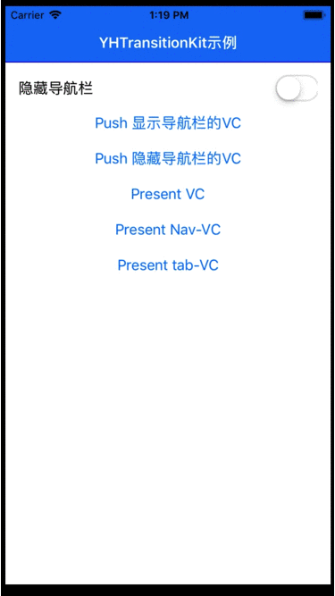
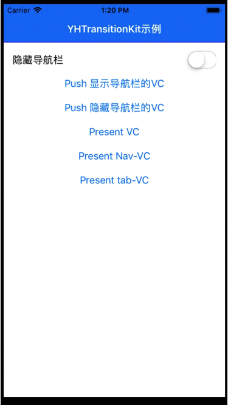

# YHTransitionKit
分类实现自定义push/present动画，自定义pop/dismiss全屏手势，navigationBar属性根据vc平滑过渡，无侵入性，低耦合性，使用更加便捷。

[](https://travis-ci.org/ye_linux@126.com/YHTransitionKit)
[](https://cocoapods.org/pods/YHTransitionKit)
[](https://cocoapods.org/pods/YHTransitionKit)
[](https://cocoapods.org/pods/YHTransitionKit)

## Features



## Example

To run the example project, clone the repo, and run `pod install` from the Example directory first.

## Requirements

## Installation

### CocoaPods (recommended practice)

YHTransitionKit is available through [CocoaPods](https://cocoapods.org). To install
it, simply add the following line to your Podfile:

```ruby

pod 'YHTransitionKit', :git => 'https://github.com/yelinux/YHTransitionKit.git'

#或者你可以单独导入
#pod 'YHTransitionKit/NavigationBar', :git => 'https://github.com/yelinux/YHTransitionKit.git'
#pod 'YHTransitionKit/PresentDismiss', :git => 'https://github.com/yelinux/YHTransitionKit.git'

```
Run `pod install` or `pod update`.

### Manually (old school way)
Drag the `YHTransitionKit/Classes` folder into your project.

## Usage
1. Example for UINavigationController's push/pop animated and gesture setting:
```objective-c
#import "YHNavigationKit.h"

    UINavigationController *nav = [[UINavigationController alloc] initWithRootViewController:vc];
    //导航栏全局设置
    nav.yh_interactivePopType = YHNavigationInteractivePopTypeFullScreen;//全屏右滑返回手势(选设)
    nav.yh_pushPopAnimated = [[YHNavigationScaleAnimated alloc] init];//自定义动画（全屏右滑返回必设，其它情况选设）
    nav.yh_navBackgroundColor = [UIColor colorWithRed:20/255.0 green:122/255.0 blue:244/255.0 alpha:1];//背景颜色(选设)
    nav.yh_titleTextAttributes = @{NSForegroundColorAttributeName:UIColor.whiteColor};//标题文本属性(选设)
    nav.yh_shadowColor = UIColor.blueColor;//分割线颜色(选设)
    nav.navigationBar.translucent = NO;
```

2. Example for UIViewController's navigationBar setting:
```objective-c
#import "YHNavigationKit.h"

@interface YHSecondViewController ()

@end

@implementation YHSecondViewController

- (void)viewDidLoad {
    [super viewDidLoad];
    // Do any additional setup after loading the view from its nib.
    //特殊设置
    self.yh_prefersNavigationBarType = YHViewControllerNavigationBarTypeShow;//导航栏是否显示(必设)
    self.yh_navBackgroundColor = [UIColor colorWithRed:220/255.0 green:189/255.0 blue:206/255.0 alpha:1];//导航栏背景颜色(选设)
    self.yh_titleTextAttributes = @{NSForegroundColorAttributeName:[UIColor colorWithRed:20/255.0 green:122/255.0 blue:244/255.0 alpha:1]};//标题文本属性(选设)
//    self.yh_backgroundImage = [UIImage imageNamed:@"nav_bg_image"];//导航栏背景图片(选设)
    self.yh_shadowColor = UIColor.grayColor;//导航栏分割线颜色(选设)
}
```

3. Example for UIViewController present/dismiss animated and close gesture setting:
```objective-c
#import "YHPresentDismissKit.h"

- (IBAction)clickPresentNav:(id)sender {
    YHSecondViewController *vc = [[YHSecondViewController alloc] init];
    UINavigationController *nav = [[UINavigationController alloc] initWithRootViewController:vc];
    nav.navigationBar.translucent = NO;
    [self yh_presentViewController:nav//模态跳转
             animatedTransitioning:YHPresentDismissScaleBottomAnimated.new//自定义跳转动画-从下向上
                        completion:^(YHBindDismissGestureBlock  _Nonnull bindDismissGestureBlock) {
        bindDismissGestureBlock(vc.view, YHPanDownDismissGesture.new);//跳转结束，绑定返回手势
    }];
}
```

## Author

WeChat:chenyehong666888, E-mail:ye_linux@126.com

## License

YHTransitionKit is available under the MIT license. See the LICENSE file for more info.
